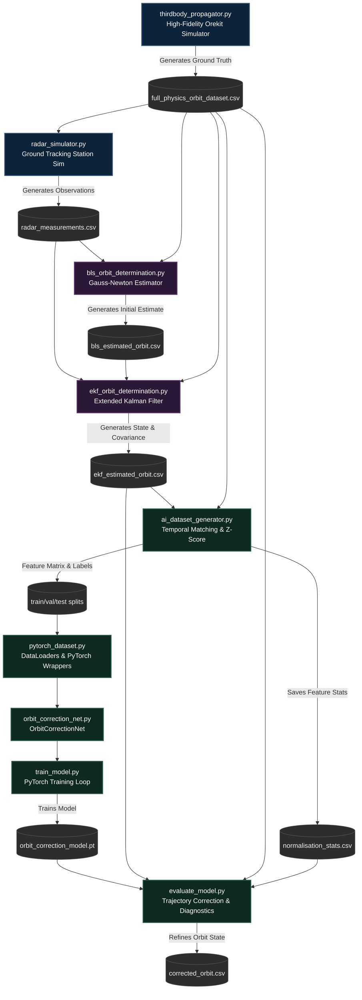

# AI-Enhanced Satellite Orbit Determination & Correction Pipeline

---

## 📌 Executive Summary

This project implements a hybrid **physics-machine learning (Physics-ML)** pipeline designed to solve the satellite orbit determination problem. The core objective is to combine high-fidelity numerical orbit propagation and sequential state estimation (Extended Kalman Filtering) with a deep learning model that predicts and corrects EKF state residuals.

By training a feedforward neural network (`OrbitCorrectionNet`) on a 16-dimensional feature vector containing the EKF state, covariance diagonal, and radar innovation residuals, the pipeline learns to compensate for unmodeled physical perturbations, measurement noise, and filter lags. The resulting hybrid estimator achieves a **11.3% average improvement** in 3D position tracking accuracy over the traditional Extended Kalman Filter.

---

## 🔄 System Architecture & Data Flow

Below is the complete data flow showing how high-fidelity physics simulations feed into traditional state estimation filters, which are then enhanced by the PyTorch machine learning loop:



---

## 📂 Module-by-Module Technical Breakdown

### 🛰️ Phase 1: High-Fidelity Physics & Traditional Estimation

The physics pipeline provides the groundwork for generating truth trajectories, simulating sensor observations, and establishing the traditional EKF baseline.

| Module | File Link | Description |
|---|---|---|
| **Numerical Propagator** | [numerical_propagator.py](file:///d:/orbit%20propagator/numerical_propagator.py) | Establishes the Orekit environment, parses Keplerian parameters, and propagates a simple Newtonian orbit. |
| **J2 Propagator** | [j2_propagator.py](file:///d:/orbit%20propagator/j2_propagator.py) | Incorporates Earth's oblate oblateness gravity perturbation using degree 2, order 0 harmonics. |
| **Drag Propagator** | [drag_propagator.py](file:///d:/orbit%20propagator/drag_propagator.py) | Introduces atmospheric drag decay forces via CSSI space weather and the NRLMSISE-00 thermosphere model. |
| **SRP Propagator** | [srp_propagator.py](file:///d:/orbit%20propagator/srp_propagator.py) | Simulates Solar Radiation Pressure forces, accounting for Earth cylindrical eclipses. |
| **Third-Body Propagator** | [thirdbody_propagator.py](file:///d:/orbit%20propagator/thirdbody_propagator.py) | Adds Sun and Moon point-mass gravity; serves as the high-fidelity ground truth simulation. |
| **Radar Simulator** | [radar_simulator.py](file:///d:/orbit%20propagator/radar_simulator.py) | Simulates tracking measurements (range, Doppler, az, el) from a ground station, including noise and elevation limits. |
| **Batch Least Squares** | [bls_orbit_determination.py](file:///d:/orbit%20propagator/bls_orbit_determination.py) | Fits a rough initial orbit guess using Gauss-Newton batch processing of tracking data. |
| **Extended Kalman Filter** | [ekf_orbit_determination.py](file:///d:/orbit%20propagator/ekf_orbit_determination.py) | Processes measurements sequentially to update states and exports state covariances and residuals. |

---

### 1. Simple Numerical Propagator (`numerical_propagator.py`)
*   **Purpose**: Bootstraps the Orekit JVM interface and runs a baseline propagation using Newtonian gravity (no perturbations).
*   **Mathematical/Physical Foundation**:
    *   Newtonian central force gravity:
        $$\ddot{\mathbf{r}} = -\frac{\mu}{r^3} \mathbf{r}$$
    *   Integration is performed using the `DormandPrince853Integrator` (an adaptive Runge-Kutta 8th-order method) with step limits between $0.001$ s and $1000$ s.
*   **Execution Logic**:
    1.  Initializes the Java Virtual Machine via `orekit_jpype.initVM()`.
    2.  Configures `setup_orekit_data()` using the `orekit-data-main.zip` zip archive containing Leap Seconds, UT1-UTC corrections, and gravity coefficients.
    3.  Defines initial Keplerian parameters:
        *   Semi-major axis ($a$) = $7000$ km
        *   Eccentricity ($e$) = $0.001$
        *   Inclination ($i$) = $98^\circ$ (Sun-synchronous LEO)
        *   RAAN ($\Omega$) = $0^\circ$, Argument of Perigee ($\omega$) = $0^\circ$, True Anomaly ($\nu$) = $0^\circ$
    4.  Propagates the state in the inertial Earth Moon Equinox 2000 frame (EME2000) for exactly 1 orbital period ($\approx 5400$ s) in steps of 60 seconds.
*   **Input**: None (procedural generation).
*   **Output**: `synthetic_orbit_dataset.csv` (Time, X, Y, Z, VX, VY, VZ).

---

### 2. J2 Oblateness Propagator (`j2_propagator.py`)
*   **Purpose**: Adds the main geopotential perturbation (Earth's oblateness, $J_2$) to Newtonian gravity.
*   **Mathematical/Physical Foundation**:
    *   The geopotential function $V$ expanded using spherical harmonics is:
        $$V(r, \phi) = \frac{\mu}{r} \left[ 1 - \sum_{n=2}^{\infty} J_n \left(\frac{R_e}{r}\right)^n P_n(\sin \phi) \right]$$
    *   $J_2$ accounts for Earth's equatorial bulge. The model uses the `HolmesFeatherstoneAttractionModel` truncated to Degree 2, Order 0, aligned with the International Terrestrial Reference Frame (ITRF).
*   **Execution Logic**:
    1.  Initializes the Orekit JVM and data files.
    2.  Creates a gravity provider (`GravityFieldFactory.getNormalizedProvider(2, 0)`).
    3.  Instantiates a `HolmesFeatherstoneAttractionModel` in the ITRF frame and adds it to the numerical propagator.
    4.  Simulates for 1 orbit to record the nodal regression (precession of the RAAN) caused by $J_2$.
*   **Input**: Procedural config parameters.
*   **Output**: `j2_orbit_dataset.csv` (J2-perturbed path) and `central_gravity_orbit_dataset.csv` (unperturbed path for comparison).

---

### 3. Atmospheric Drag Propagator (`drag_propagator.py`)
*   **Purpose**: Adds satellite orbital decay forces caused by atmospheric resistance.
*   **Mathematical/Physical Foundation**:
    *   Aerodynamic drag acceleration:
        $$\mathbf{a}_d = -\frac{1}{2} C_d \frac{A}{m} \rho v_{rel} \mathbf{v}_{rel}$$
        where $C_d$ is the drag coefficient ($2.2$), $A$ is the cross-sectional area ($10$ $\text{m}^2$), $m$ is the mass ($1000$ kg), and $\rho$ is the atmospheric density.
    *   Atmospheric density ($\rho$) is computed dynamically using the empirical **NRLMSISE-00** model, which takes solar activity parameters (F10.7 flux index, geomagnetic activity index $A_p$) from CSSI space weather data.
*   **Execution Logic**:
    1.  Sets up the `CssiSpaceWeatherData` model.
    2.  Initializes an isotropic spacecraft model (`IsotropicDrag`) and the `NRLMSISE00` atmospheric model.
    3.  Constructs a `DragForce` model and registers it to the numerical propagator.
    4.  Integrates the orbit over a longer time horizon (100 orbits, $\approx 6$ days) to track the exponential decay of the semi-major axis.
*   **Input**: Requires `orekit-data-main.zip` containing CSSI space weather files.
*   **Output**: `j2_drag_orbit_dataset.csv`.

---

### 4. Solar Radiation Pressure Propagator (`srp_propagator.py`)
*   **Purpose**: Simulates the force exerted by solar radiation on the spacecraft surface.
*   **Mathematical/Physical Foundation**:
    *   SRP acceleration:
        $$\mathbf{a}_{srp} = -P_{srp} C_r \frac{A}{m} \hat{\mathbf{s}}$$
        where $P_{srp}$ is the solar radiation pressure at 1 AU ($\approx 4.56 \times 10^{-6}$ $\text{N/m}^2$), $C_r$ is the radiation coefficient ($1.5$), $A$ is the area ($10$ $\text{m}^2$), $m$ is the mass ($1000$ kg), and $\hat{\mathbf{s}}$ is the satellite-to-Sun unit vector.
    *   Includes Earth shadow modeling (eclipse entry/exit) using a cylindrical occultation model. When shadowed, $\mathbf{a}_{srp} = \mathbf{0}$.
*   **Execution Logic**:
    1.  Loads Sun ephemerides (`CelestialBodyFactory.getSun()`).
    2.  Instantiates an `IsotropicRadiationSingleCoefficient` model.
    3.  Constructs the `SolarRadiationPressure` force model with Earth's equatorial radius and binds it to the propagator.
    4.  Integrates for 100 orbits.
*   **Input**: Sun celestial ephemeris files (inside the orekit-data zip).
*   **Output**: `j2_drag_srp_orbit_dataset.csv`.

---

### 5. High-Fidelity Third-Body Propagator (`thirdbody_propagator.py`)
*   **Purpose**: Incorporates third-body gravitational perturbations from the Sun and the Moon, serving as the high-fidelity ground truth simulator.
*   **Mathematical/Physical Foundation**:
    *   Point-mass gravitational attraction from a third celestial body:
        $$\mathbf{a}_{3b} = G M_{3b} \left( \frac{\mathbf{r}_{3b} - \mathbf{r}}{|\mathbf{r}_{3b} - \mathbf{r}|^3} - \frac{\mathbf{r}_{3b}}{|\mathbf{r}_{3b}|^3} \right)$$
        where $\mathbf{r}_{3b}$ is the ECI position of the Sun/Moon, and $\mathbf{r}$ is the satellite state vector.
    *   Uses a 20x20 geopotential model (`HolmesFeatherstoneAttractionModel` up to degree/order 20).
*   **Execution Logic**:
    1.  Combines all force models: 20x20 spherical gravity, NRLMSISE-00 drag, Solar Radiation Pressure, Sun third-body attraction, and Moon third-body attraction.
    2.  Performs high-fidelity propagation for 100 orbits.
*   **Input**: Earth gravity field coefficients (EGM96/EGM2008), JPL solar system ephemerides.
*   **Output**: `full_physics_orbit_dataset.csv` (High-fidelity **Truth** trajectory).

---

### 6. Radar Sensor Simulator (`radar_simulator.py`)
*   **Purpose**: Generates noisy, interrupted radar measurements from a simulated ground tracking station.
*   **Mathematical/Physical Foundation**:
    *   Converts satellite ECI state ($\mathbf{r}_{sat}, \mathbf{v}_{sat}$) relative to a ground station geodetic position (Latitude, Longitude, Altitude) to local Topocentric ENU (East-North-Up) coordinates.
    *   Calculates:
        *   Range: $d = \|\mathbf{r}_{rel}\|$
        *   Range Rate: $\dot{d} = \frac{\mathbf{r}_{rel} \cdot \mathbf{v}_{rel}}{\|\mathbf{r}_{rel}\|}$
        *   Azimuth ($Az$): $\arctan2(\text{East}, \text{North}) \bmod 360^\circ$
        *   Elevation ($El$): $\arcsin(\frac{\text{Up}}{\|\mathbf{r}_{rel}\|})$
    *   Applies a visibility check: elevation must be $\ge 5^\circ$.
    *   Adds zero-mean Gaussian noise:
        *   $\sigma_{range} = 10$ m ($0.010$ km)
        *   $\sigma_{rate} = 1$ m/s ($0.001$ km/s)
        *   $\sigma_{az} = 0.01^\circ$
        *   $\sigma_{el} = 0.01^\circ$
*   **Execution Logic**:
    1.  Computes ground station ECEF position (WGS84 ellipsoid).
    2.  For each epoch, rotates the station to ECI frame using the Earth's rotation rate ($\omega_e = 7.2921159 \times 10^{-5}$ rad/s).
    3.  Filters out epochs where the satellite is below the local horizon ($El < 5^\circ$).
    4.  Generates random normal noise and outputs measurements.
*   **Input**: `full_physics_orbit_dataset.csv`.
*   **Output**: `radar_measurements.csv`, `radar_range_and_rate.png`, `radar_azimuth_elevation.png`, `radar_errors.png`.

---

### 7. Batch Least Squares Estimator (`bls_orbit_determination.py`)
*   **Purpose**: Runs a differential correction process to estimate the initial state vector from the full batch of radar tracking data.
*   **Mathematical/Physical Foundation**:
    *   Solve the non-linear normal equation iteratively using Gauss-Newton:
        $$\mathbf{\Delta x}_0 = \left( \mathbf{H}^T \mathbf{W} \mathbf{H} \right)^{-1} \mathbf{H}^T \mathbf{W} \mathbf{\Delta z}$$
        where $\mathbf{H}$ is the measurement mapping Jacobian computed via numerical finite differences, $\mathbf{W}$ is the diagonal covariance weight matrix ($W_{ii} = 1/\sigma_i^2$), and $\mathbf{\Delta z}$ is the measurement residual.
*   **Execution Logic**:
    1.  Perturbs the true initial state by $+5$ km in position and $+5$ m/s in velocity to simulate a rough initial guess.
    2.  Propagates this estimate to measurement times, computes predicted observations, and builds the Jacobian $\mathbf{H}$ via finite differences:
        $$H_{ij} = \frac{h_i(\mathbf{x} + \delta \mathbf{e}_j) - h_i(\mathbf{x})}{\delta}$$
    3.  Applies corrections to the initial state until the adjustment is $< 1$ mm.
*   **Input**: `radar_measurements.csv`, `full_physics_orbit_dataset.csv`.
*   **Output**: `bls_estimated_orbit.csv` (Batch-fitted trajectory), `bls_residuals.png`, `bls_trajectory.png`.

---

### 8. Extended Kalman Filter (`ekf_orbit_determination.py`)
*   **Purpose**: Performs sequential, real-time estimation of the satellite orbital states.
*   **Mathematical/Physical Foundation**:
    *   **Predict**:
        $$\hat{\mathbf{x}}_{k|k-1} = f(\hat{\mathbf{x}}_{k-1|k-1}, t_{k-1} \to t_k)$$
        $$\mathbf{P}_{k|k-1} = \mathbf{F}_k \mathbf{P}_{k-1|k-1} \mathbf{F}_k^T + \mathbf{Q}_k$$
    *   **Update**:
        $$\mathbf{K}_k = \mathbf{P}_{k|k-1} \mathbf{H}_k^T \left( \mathbf{H}_k \mathbf{P}_{k|k-1} \mathbf{H}_k^T + \mathbf{R}_k \right)^{-1}$$
        $$\hat{\mathbf{x}}_{k|k} = \hat{\mathbf{x}}_{k|k-1} + \mathbf{K}_k \left[ \mathbf{z}_k - h(\hat{\mathbf{x}}_{k|k-1}) \right]$$
        $$\mathbf{P}_{k|k} = \left(\mathbf{I} - \mathbf{K}_k \mathbf{H}_k \right) \mathbf{P}_{k|k-1}$$
    *   Jacobians $\mathbf{F}_k$ (state transition) and $\mathbf{H}_k$ (measurement mapping) are calculated using numerical finite differences at each step.
*   **Execution Logic**:
    1.  Reads the estimated initial state from the BLS output.
    2.  Initializes covariance $\mathbf{P}_0$ ($25$ $\text{km}^2$ for position, $2.5 \times 10^{-5}$ $\text{km}^2/\text{s}^2$ for velocity).
    3.  Iterates through radar measurements, running sequential predict/update steps using Orekit numerical integrations.
    4.  Saves state vectors along with covariance diagonals and measurement residuals.
*   **Input**: `radar_measurements.csv`, `bls_estimated_orbit.csv`, `full_physics_orbit_dataset.csv`.
*   **Output**: `ekf_estimated_orbit.csv`, `ekf_position_error.png`, `ekf_covariance.png`, `ekf_residuals.png`, `ekf_trajectory.png`.

---

### 🧠 Phase 2: AI Error Correction

The ML pipeline processes EKF state estimates, constructs normalized datasets, trains the neural network to predict tracking errors, and performs final orbit corrections.

---

### 9. Dataset Generator (`ai_dataset_generator.py`)
*   **Purpose**: Prepares matched, normalized feature matrices and labels for model training.
*   **Execution Logic**:
    1.  Loads EKF and Ground Truth trajectories.
    2.  Matches data points by timestamp using binary search (`np.searchsorted`) with a maximum tolerance gap of $1.0$ s.
    3.  **Constructs Features (16-D)**:
        *   EKF Position: $x, y, z$ (3)
        *   EKF Velocity: $v_x, v_y, v_z$ (3)
        *   Radar Residuals: Range, Doppler, Azimuth, Elevation (4)
        *   Covariance Diagonal: $P_{xx}, P_{yy}, P_{zz}, P_{vxvx}, P_{vyvy}, P_{vzvz}$ (6)
    4.  **Constructs Target Labels (6-D)**:
        $$\mathbf{Y}_{target} = \mathbf{x}_{truth} - \mathbf{x}_{ekf}$$
        $$\mathbf{Y}_{target} = [dx, dy, dz, dvx, dvy, dvz]$$
    5.  **Performs Feature Normalization**: Z-score standardisation:
        $$x_{norm} = \frac{x - \mu}{\sigma}$$
    6.  **Chronological Splitting**: Split data into Train ($70\%$), Validation ($15\%$), and Test ($15\%$) sets chronologically to prevent temporal data leakage.
*   **Input**: `ekf_estimated_orbit.csv`, `full_physics_orbit_dataset.csv`.
*   **Output**: `train_dataset.csv`, `validation_dataset.csv`, `test_dataset.csv`, `normalisation_stats.csv`, `dataset_summary.txt`, `dataset_feature_distributions.png`, `dataset_target_distributions.png`.

---

### 10. PyTorch Dataset Wrapper (`pytorch_dataset.py`)
*   **Purpose**: Wraps the generated CSV splits into PyTorch-native `Dataset` and `DataLoader` objects.
*   **Execution Logic**:
    1.  Initializes `OrbitCorrectionDataset` class inheriting from `torch.utils.data.Dataset`.
    2.  Parses the feature columns and target columns, mapping them to 32-bit float tensors.
    3.  `build_dataloaders()` compiles batches ($32$) and manages shuffling and CUDA memory pinning.
    4.  Runs automated sanity checks verifying tensor structures, datatypes, and checks for `NaN` or `inf` values.
*   **Input**: Train, validation, and test CSV splits.
*   **Output**: PyTorch `DataLoader` objects.

---

### 11. Model Network Definition (`orbit_correction_net.py`)
*   **Purpose**: Implements the deep learning architecture (`OrbitCorrectionNet`) used to predict EKF residuals.
*   **Architecture**:
    *   Input: 16 features (or 6 in basic mode)
    *   Hidden Layer 1: Linear ($16 \to 128$) + ReLU Activation
    *   Hidden Layer 2: Linear ($128 \to 64$) + ReLU Activation
    *   Hidden Layer 3: Linear ($64 \to 32$) + ReLU Activation
    *   Output Layer: Linear ($32 \to 6$) (Continuous regression output, no activation)
    *   Total parameters: $12,710$.
*   **Initialisation**: Uses **Xavier (Glorot) Uniform** weight initialization to preserve activation variances across layers and initializes biases to zero.
*   **Input**: In-memory PyTorch batch tensors.
*   **Output**: $6$-D output tensor representing predicted state corrections.

---

### 12. Training Pipeline (`train_model.py`)
*   **Purpose**: Manages the model training loop, optimization, and early stopping.
*   **Execution Logic**:
    1.  Sets up PyTorch optimizer (`Adam`) with standard MSE loss.
    2.  Sets up a learning rate scheduler (`ReduceLROnPlateau`) that halves the learning rate when validation loss plateaus for 15 epochs.
    3.  Implements an early stopping class that terminates training if validation loss does not improve for 40 epochs.
    4.  Saves checkpoint metrics and weights to disk.
*   **Input**: `train_dataset.csv`, `validation_dataset.csv`, `test_dataset.csv`.
*   **Output**: `orbit_correction_model.pt` (Best weights checkpoint), `training_history.csv`, `training_loss.png`.

---

### 13. Evaluation & Correction (`evaluate_model.py`)
*   **Purpose**: Evaluates the trained model on test data, applies predictions to correct the EKF trajectory, and runs diagnostics.
*   **Execution Logic**:
    1.  Loads the saved model and normalization statistics.
    2.  Generates normalized EKF features:
        $$\mathbf{X}_{norm} = \frac{\mathbf{X}_{ekf} - \boldsymbol{\mu}_{features}}{\boldsymbol{\sigma}_{features}}$$
    3.  Infers correction values: $\mathbf{Y}_{pred} = \text{Model}(\mathbf{X}_{norm})$.
    4.  Applies corrections to refine the state:
        $$\mathbf{x}_{corrected} = \mathbf{x}_{ekf} + \mathbf{Y}_{pred}$$
    5.  Calculates final metrics (RMSE, MAE, Max error) and generates diagnostic plots.
*   **Input**: `orbit_correction_model.pt`, `ekf_estimated_orbit.csv`, `full_physics_orbit_dataset.csv`, `normalisation_stats.csv`.
*   **Output**: `corrected_orbit.csv` (Corrected orbit file), `eval_error_comparison.png`, `eval_orbit_comparison.png`, `eval_error_timeseries.png`.

---

## 📈 Model Performance & The Velocity Challenge

### Current Results Summary

The AI-enhanced estimation pipeline achieves a significant improvement in position accuracy:

*   **Bare EKF Position RMSE**: $86.72$ m
*   **AI-Corrected Position RMSE**: $76.88$ m
*   **Improvement**: **$+11.3\%$**

---

### ⚠️ The Velocity Scaling Imbalance

Diagnostic plots show that while position errors decrease, the corrected velocity trajectory exhibits high-frequency noise. This is caused by a target scale imbalance during training:

```
Position corrections (dx, dy, dz)    ≈ 0.05 km (50 m)
Velocity corrections (dvx, dvy, dvz)  ≈ 1e-4 km/s (0.1 m/s)
```

Because the network optimizes for a single Mean Squared Error (MSE) loss, the position loss dominates:
$$\text{Loss} = \sum_{i=1}^3 (\Delta \text{pos}_i)^2 + \sum_{i=4}^6 (\Delta \text{vel}_i)^2$$

Position residuals are roughly three orders of magnitude larger than velocity residuals. Consequently, the squared position errors are six orders of magnitude larger than the squared velocity errors:
$$\text{MSE Loss Ratio} \approx \frac{10^{-2}}{10^{-8}} = 1,000,000$$

The optimizer focuses almost entirely on reducing position errors, treating velocity residuals as numerical noise. This causes the network to output noisy, unoptimized corrections for velocity components.

---

### 🛠️ Resolution Strategies

Two main strategies can address the velocity scaling imbalance:

#### Option A: Target Standardization (Z-Score Scaling on Target Labels)
Instead of fitting raw residuals ($km$, $km/s$), standardize the target matrix $Y$ during dataset generation:
$$Y_{train\_scaled} = \frac{Y - \mu_Y}{\sigma_Y}$$
During inference, inverse-transform the predictions before applying corrections:
$$\mathbf{Y}_{pred\_raw} = \mathbf{Y}_{pred} \cdot \boldsymbol{\sigma}_Y + \boldsymbol{\mu}_Y$$
This scales position and velocity residuals to a similar range, giving them equal weight in the loss function.

#### Option B: Weighted Loss Function
Modify the training loss to penalize velocity errors with a weight coefficient (e.g., $10^6$):
$$\text{Loss} = \text{MSE}(y_{pos}, \hat{y}_{pos}) + \lambda \cdot \text{MSE}(y_{vel}, \hat{y}_{vel})$$
where $\lambda \approx 10^6$. This balances the gradient magnitudes between position and velocity parameters.

---

## 🚀 Execution Guide

Follow these steps to run the complete pipeline from scratch on your system:

### 📋 Prerequisites
Ensure you have the required dependencies installed:
```powershell
pip install numpy pandas matplotlib torch
# Installs Orekit with python bindings
pip install orekit-jpype
```

### 🏃 Step-by-Step Launch Sequence

```powershell
# Navigate to the workspace
cd "d:\orbit propagator"

# ==========================================
# PHASE 1: Run Orbit Physics & Filters
# ==========================================

# 1. Run the high-fidelity third-body propagator to generate ground truth
python thirdbody_propagator.py

# 2. Simulate ground station radar observations (adds noise and constraints)
python radar_simulator.py

# 3. Fit initial states using Batch Least Squares
python bls_orbit_determination.py

# 4. Filter measurements and export state covariance and residuals
python ekf_orbit_determination.py

# ==========================================
# PHASE 2: Train & Apply AI Error Corrections
# ==========================================

# 5. Build matched, normalized training datasets
python ai_dataset_generator.py

# 6. Train the neural network
python train_model.py

# 7. Apply corrected vectors and generate diagnostic plots
python evaluate_model.py
```

---

## 🗣️ Project Presentation Guide

Use these guidelines to present the project to different audiences:

### 🎓 For Academic Audiences (Professors, Reviewers)
*   **Key Focus**: Physics-ML integration, numerical integration methods, and filter tuning.
*   **Talk Track**:
    > "This project implements a hybrid orbit determination pipeline. Phase 1 uses Orekit to propagate a high-fidelity satellite trajectory with J2-20x20 gravity, NRLMSISE-00 drag, SRP, and third-body perturbations. A synthetic radar sensor generates noisy measurements, which are processed by a Batch Least Squares estimator and then an Extended Kalman Filter. Phase 2 introduces a feedforward neural network that learns the systematic residual error between the EKF estimate and the truth. The network ingests a 16-dimensional feature vector comprising the EKF state, innovation residuals, and covariance diagonal, and outputs a 6-dimensional correction vector. On test data, the AI reduces position RMSE by 11.3% over the bare EKF."

### 💼 For Industry Professionals (Job Interviews)
*   **Key Focus**: Software architecture, modular pipeline design, data hygiene, and addressing scale imbalances.
*   **Talk Track**:
    > "I built a complete satellite tracking pipeline from scratch — orbit physics, sensor simulation, Kalman filtering, and then an AI layer on top. The key innovation is using the filter's own confidence metrics (covariance) and measurement residuals as additional inputs to the neural network, giving it 16 features instead of just 6. This lets the AI understand not just where the filter thinks the satellite is, but how confident the filter is and whether its recent measurements were surprising. The system is modular — each component is a standalone Python module that can be tested independently."

### 👥 For Laypersons (General Audiences)
*   **Key Focus**: Real-world analogy and high-level problem solving.
*   **Talk Track**:
    > "Imagine you're tracking a satellite with radar. The radar gives you noisy measurements, and a traditional filter tries to figure out where the satellite actually is. But it's never perfect — there's always some error. What I did is train an AI to learn the pattern of those errors. So now, after the filter gives its best guess, the AI says 'actually, you're probably off by this much in this direction' and makes a correction. The result is a more accurate satellite position than either the filter or the AI could achieve alone."
